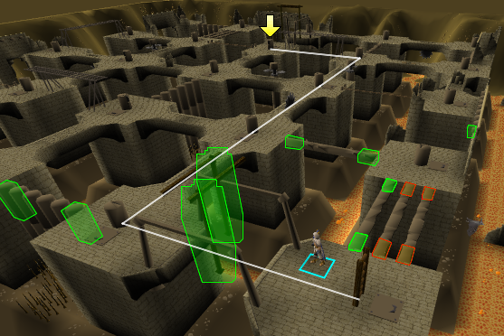
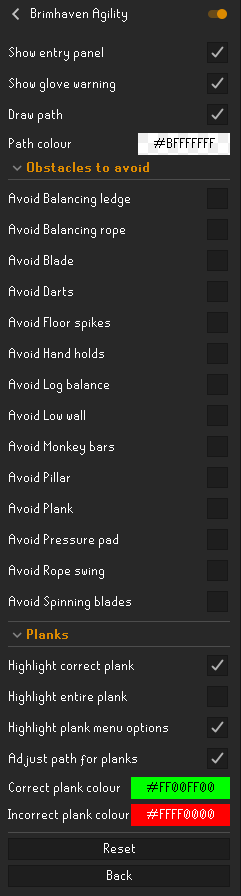

# Brimhaven Agility Arena RuneLite Plugin

This is a [RuneLite](https://runelite.net/) plugin to help with the Brimhaven Agility Arena
in [OSRS](https://oldschool.runescape.com/). It draws the shortest path (weighted by obstacle) to the active ticket
dispenser, taking into account your character's agility level. The path is found using the A* pathfinding algorithm.

## Configuration

If the player wishes to avoid a particular obstacle, they can do so using configuration. This may be useful to, for
example, avoid the darts obstacle which lowers your agility level by 2 when failed.

## Possible future features

These are potential ideas for future expansions of this plugin.

* removing the hint arrow once the ticket has been claimed
* highlighting the correct plank to use on the 3 plank obstacle
* an overlay when outside the arena displaying whether the player can enter (taking into account the teleport time-out
  and whether the player has paid or not)

## Acknowledgements

* Wouldn't be possible without the excellent [RuneLite](https://github.com/runelite/runelite), and has been generated
  based on their [example plugin](https://github.com/runelite/example-plugin)
* The code used to actually draw the line on screen has been taken from
  the [Quest Helper](https://github.com/Zoinkwiz/quest-helper) plugin.
* A* pathfinding code was based
  on [Wikipedia's pseudocode](https://en.wikipedia.org/wiki/A*_search_algorithm#Pseudocode) implementation
* Information on the Brimhaven Agility Arena was taken from
  the [OSRS Wiki](https://oldschool.runescape.wiki/w/Brimhaven_Agility_Arena), in particular the layout, level
  requirements, and time to complete each obstacle
* Jagex, and especially the OSRS team, for creating & maintaining Old School Runescape