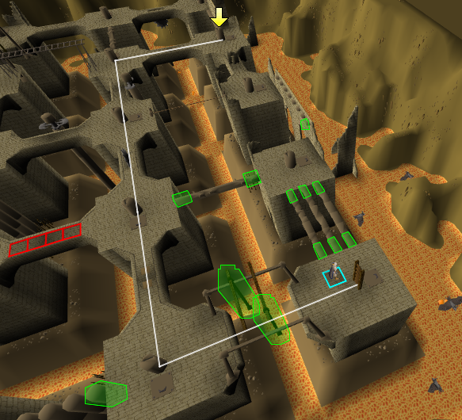

# Brimhaven Agility Arena RuneLite Plugin

This is a [RuneLite](https://runelite.net/) plugin to help with the Brimhaven Agility Arena
in [OSRS](https://oldschool.runescape.com/). It draws the shortest path (weighted by obstacle) to the active ticket
dispenser, taking into account your character's agility level. The path is found using the A* pathfinding algorithm.

## Configuration

Weightings are configurable so if the user wants to avoid a specific obstacle, they can do so by giving it a very high
weighting.

## Acknowledgements

* Wouldn't be possible without the excellent [RuneLite](https://github.com/runelite/runelite), and has been generated
  based on their [example plugin](https://github.com/runelite/example-plugin)
* The code used to actually draw the line on screen has been taken from
  the [Quest Helper](https://github.com/Zoinkwiz/quest-helper) plugin.
* A* pathfinding code was based
  on [Wikipedia's pseudocode](https://en.wikipedia.org/wiki/A*_search_algorithm#Pseudocode) implementation
* Jagex, for creating & maintaining Old School Runescape