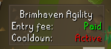

# Brimhaven Agility Arena RuneLite Plugin

&replace=v%241&label=Git%20Version)

This is a [RuneLite](https://runelite.net/) plugin to help with the Brimhaven Agility Arena
in [OSRS](https://oldschool.runescape.com/).

## Features

### Pathfinder

Draws the shortest path (weighted by obstacle) to the active ticket dispenser, taking into account your character's
agility level. The path is found using the A* pathfinding algorithm.

### Entry panel

A panel that appears when near the entry of the agility arena, indicating whether the exit cooldown period has elapsed
and whether the entry fee has been paid.

### Diary gloves warning

A panel that appears when your account has completed at least all the tasks in the Karamja Easy &amp; Medium Diaries,
but your character is not wearing the Karamja Gloves 2, 3, or 4. Only appears when near the entrance or in the arena.

When worn, the Karamja Gloves 2, 3, and 4 all grant 10% extra agility experience from obstacles and cashing in tickets.

### Plank obstacle solver

Highlights the correct plank of the three planks obstacle to use. Also, deprioritizes the "Walk-on" menu option for the
incorrect planks.

## Configuration

Each [feature](#features) of the plugin can be toggled on and off individually.

If the player wishes to avoid a particular obstacle, they can configure the path to do so. This may be useful to, for
example, avoid the darts obstacle which lowers your agility level by 2 when failed.

## Possible future features

These are potential ideas for future expansions of this plugin.

* removing the hint arrow once the ticket has been claimed. A branch exists for
  this [here](https://github.com/kagof/rl-plugin-brimhaven-agility/compare/remove-hint), but it breaks some of the core
  Agility plugin's functionality, therefore [this PR](https://github.com/runelite/runelite/pull/19407) needs to be
  accepted into Runelite before this feature can be added

## Changelog

### Unreleased

* new configurable feature - highlighting & menu deprioritization for the 3 planks obstacle

### [1.1.0](https://github.com/kagof/rl-plugin-brimhaven-agility/releases/tag/v1.1.0)

* new configurable feature - entry panel
* new configurable feature - Karamja gloves warning

### [1.0.0](https://github.com/kagof/rl-plugin-brimhaven-agility/releases/tag/v1.0.0)

* computes & displays shortest path to active dispenser, with configurable options

## Acknowledgements

* Wouldn't be possible without the excellent [RuneLite](https://github.com/runelite/runelite), and has been generated
  based on their [example plugin](https://github.com/runelite/example-plugin)
* The code used to actually draw the line on screen has been taken from
  the [Quest Helper](https://github.com/Zoinkwiz/quest-helper) plugin.
* A* pathfinding code was based
  on [Wikipedia's pseudocode](https://en.wikipedia.org/wiki/A*_search_algorithm#Pseudocode) implementation
* Information on the Brimhaven Agility Arena was taken from
  the [OSRS Wiki](https://oldschool.runescape.wiki/w/Brimhaven_Agility_Arena), in particular the layout, level
  requirements, and time to complete each obstacle
* Jagex, and especially the OSRS team, for creating & maintaining Old School Runescape