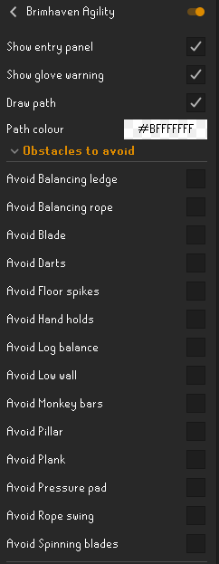

# Brimhaven Agility Arena RuneLite Plugin

This is a [RuneLite](https://github.com/runelite/runelite) plugin to help with the Brimhaven Agility Arena
in [OSRS](https://oldschool.runescape.com/). It draws the shortest path (weighted by obstacle) to the active ticket
dispenser, taking into account your character's agility level. The path is found using the A* pathfinding algorithm.

Weightings are configurable so if the user wants to avoid a specific obstacle, they can do so by giving it a very high
weighting.

The code used to actually draw the line on screen has been taken from
the [Quest Helper](https://github.com/Zoinkwiz/quest-helper) plugin.